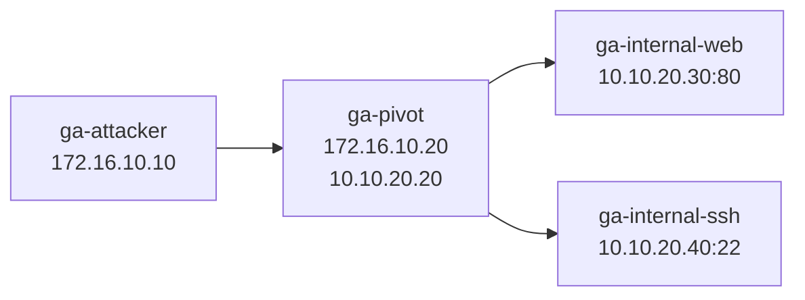

<p align="center">
  
</p>

# GREEN ARMOR CYBER RANGE

## Pivoting, Tunneling & Port Forwarding Lab

A self-contained Docker-based cybersecurity lab designed for practical training in network pivoting, tunneling, SSH port forwarding, SOCKS proxies, and internal network access.

[العربية](README_AR.md) · [Student Guide](docs/STUDENT-GUIDE.md) · [Troubleshooting](docs/TROUBLESHOOTING.md)

---

## Overview

**GREEN ARMOR CYBER RANGE** is an isolated training environment designed to practice:

- Network discovery and route awareness
- Pivot host identification
- SSH Local Port Forwarding
- SSH Dynamic Port Forwarding
- SOCKS proxy tunneling
- Proxychains-based access through a SOCKS tunnel
- Access validation to isolated internal services
- Technical documentation of the final access path

**Created & Developed by Jehad Ghaben**  
**Founder & CEO — GREEN ARMOR CYBER SECURITY**

---

## Lab Topology



The attacker is connected only to the corporate network.

The pivot host is **dual-homed** and is the only lab system connected to both networks.

The internal services are located on an isolated internal network and are not directly published to the host.

### Corporate Network

```text
172.16.10.0/24
```

### Internal Network

```text
10.10.20.0/24
```

---

## Requirements

Before starting the lab, make sure you have:

- Docker Engine or Docker Desktop
- Docker Compose v2
- Linux, macOS, or Windows with WSL2/Docker Desktop
- At least 2 GB of free RAM
- At least 2 GB of free disk space

Check Docker:

```bash
docker --version
docker compose version
```

---

# Quick Start

## 1. Clone the Repository

```bash
git clone https://github.com/JehadGhaben/green-armor-cyber-range.git
```

Enter the project directory:

```bash
cd green-armor-cyber-range
```

---

## 2. Make the Scripts Executable

```bash
chmod +x *.sh tests/*.sh
```

---

## 3. Start the Lab

```bash
./start.sh
```

Docker will build and start the GREEN ARMOR Cyber Range environment.

---

## 4. Check Lab Status

```bash
./status.sh
```

You should see the lab containers running.

---

## 5. Open the Attacker Environment

```bash
./shell.sh
```

Inside the attacker container, start by running:

```bash
mission
```

Then inspect the attacker network configuration:

```bash
myip
```

```bash
routes
```

The student should begin the lab from this environment.

---

# Training Credentials

## Pivot Host

```text
Username: pivot
Password: PivotLab2026!
```

## Internal SSH Service

```text
Username: internal
Password: InternalLab2026!
```

These credentials are intentionally included as part of the controlled training scenario.

---

# Intended Learning Flow

```text
Discovery
   ↓
Pivot Host Identification
   ↓
Internal Network Discovery
   ↓
Tunnel Creation
   ↓
Internal Access
   ↓
Validation
   ↓
Documentation
```

Students should follow:

[`docs/STUDENT-GUIDE.md`](docs/STUDENT-GUIDE.md)

---

# Lab Scenario

The attacker begins with access only to:

```text
172.16.10.0/24
```

The attacker must identify the pivot host:

```text
172.16.10.20
```

The pivot host is connected to two networks:

```text
172.16.10.20
10.10.20.20
```

Behind the pivot exists an isolated internal network:

```text
10.10.20.0/24
```

Internal services include:

```text
10.10.20.30:80
10.10.20.40:22
```

The objective is to understand and document the path:

```text
Attacker
   ↓
Pivot Host
   ↓
Tunnel
   ↓
Internal Network
   ↓
Internal Service
```

---

# Example Training Techniques

The lab supports training with techniques such as:

### SSH Local Port Forwarding

```bash
ssh -L 8080:10.10.20.30:80 pivot@172.16.10.20
```

The internal web service can then be accessed through:

```text
http://127.0.0.1:8080
```

---

### SSH Dynamic Port Forwarding

```bash
ssh -D 1080 -N pivot@172.16.10.20
```

Applications can then route traffic through the SOCKS proxy:

```text
127.0.0.1:1080
```

Example:

```bash
curl --socks5-hostname 127.0.0.1:1080 http://10.10.20.30
```

---

# Instructor Validation

After starting the lab:

```bash
./start.sh
```

Run the automated validation:

```bash
./tests/self-test.sh
```

The validation is designed to check:

- All required containers are running
- Expected IP addressing is present
- The attacker can reach the pivot SSH service
- The pivot can access the internal web service
- The pivot can access the internal SSH service
- The attacker cannot directly access the isolated internal web service
- SSH Local Port Forwarding works
- SSH Dynamic SOCKS forwarding works
- Internal services can be reached through the tunnel

Expected successful result:

```text
Self-test result: 12 passed, 0 failed.
```

---

# Management Commands

| Action | Command |
|---|---|
| Start/build lab | `./start.sh` |
| Open attacker shell | `./shell.sh` |
| Show container status | `./status.sh` |
| Run validation | `./tests/self-test.sh` |
| Reset lab | `./reset.sh` |
| Stop lab | `./stop.sh` |
| Show logs | `docker compose logs -f` |

---

# Make Commands

Equivalent Make targets are available.

Start:

```bash
make start
```

Open attacker shell:

```bash
make shell
```

Show status:

```bash
make status
```

Run tests:

```bash
make test
```

Reset:

```bash
make reset
```

Stop:

```bash
make stop
```

---

# Project Structure

```text
green-armor-cyber-range/
│
├── .github/
│   ├── ISSUE_TEMPLATE/
│   └── workflows/
│
├── assets/
│   └── logo.png
│
├── attacker/
├── pivot/
├── internal-web/
├── internal-ssh/
│
├── docs/
│   ├── STUDENT-GUIDE.md
│   └── TROUBLESHOOTING.md
│
├── tests/
│   └── self-test.sh
│
├── compose.yaml
├── Makefile
├── README.md
├── README_AR.md
├── SECURITY.md
├── start.sh
├── status.sh
├── shell.sh
├── reset.sh
└── stop.sh
```

---

# Continuous Validation

The repository includes a GitHub Actions workflow designed to:

1. Build the Docker lab
2. Start the environment
3. Verify container status
4. Run the automated self-test
5. Report validation results
6. Tear down the environment

This helps detect configuration problems after repository updates.

---

# Reset the Lab

To return the environment to a clean state:

```bash
./reset.sh
```

---

# Stop the Lab

```bash
./stop.sh
```

---

# Troubleshooting

If the lab does not start correctly:

```bash
docker compose ps
```

Check logs:

```bash
docker compose logs
```

Or:

```bash
docker compose logs -f
```

For additional help see:

[`docs/TROUBLESHOOTING.md`](docs/TROUBLESHOOTING.md)

---

# Safety

This project is an isolated cybersecurity training environment.

Use the techniques demonstrated in this lab only:

- Inside this training environment
- On systems you own
- Or on systems you have explicit authorization to test

Do not apply these techniques against unauthorized systems.

---

<p align="center">
  <strong>GREEN ARMOR CYBER SECURITY</strong><br>
  Practical Cybersecurity Training
</p>

<p align="center">
  Created & Developed by <strong>Jehad Ghaben</strong><br>
  Founder & CEO — GREEN ARMOR CYBER SECURITY
</p>
