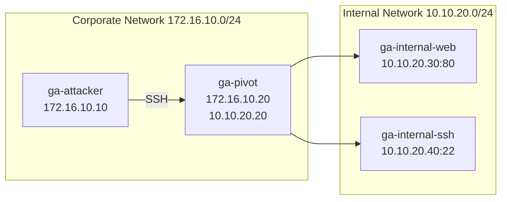

<p align="center">
  
</p>

<h1 align="center">GREEN ARMOR CYBER RANGE</h1>
<p align="center"><strong>Pivoting, Tunneling & Port Forwarding Lab</strong></p>
<p align="center">A self-contained Docker lab for practical network pivoting training.</p>

<p align="center">
  <a href="README_AR.md">العربية</a> ·
  <a href="docs/STUDENT-GUIDE.md">Student Guide</a> ·
  <a href="docs/TROUBLESHOOTING.md">Troubleshooting</a>
</p>

## Overview

GREEN ARMOR CYBER RANGE is an isolated training environment designed to practice:

- network discovery and route awareness
- pivot-host identification
- SSH Local Port Forwarding
- SSH Dynamic Port Forwarding / SOCKS
- Proxychains-based access through a SOCKS tunnel
- validation of access to isolated internal services
- technical documentation of the final access path

**Created & Developed by Jehad Ghaben**  
**Founder & CEO — GREEN ARMOR CYBER SECURITY**

## Lab topology



The attacker is connected only to the corporate network. The pivot is dual-homed and is the only lab system connected to both networks. Internal services are not published to the host.

## Requirements

- Docker Engine or Docker Desktop
- Docker Compose v2
- Linux, macOS, or Windows with WSL2/Docker Desktop
- Recommended minimum: 2 GB free RAM and 2 GB free disk space

## Quick start

Clone the repository:

```bash
git clone https://github.com/YOUR-USERNAME/green-armor-cyber-range.git
cd green-armor-cyber-range
```

Make the scripts executable and start the lab:

```bash
chmod +x *.sh tests/*.sh
./start.sh
```

Open the attacker shell:

```bash
./shell.sh
```

Then inside the attacker container:

```bash
mission
myip
routes
```

## Training credentials

Pivot host:

```text
Username: pivot
Password: PivotLab2026!
```

Internal SSH service:

```text
Username: internal
Password: InternalLab2026!
```

These credentials are intentionally included for the training scenario.

## Intended learning flow

```text
Discovery
  ↓
Pivot Identification
  ↓
Tunnel Creation
  ↓
Internal Access
  ↓
Validation
  ↓
Documentation
```

Students should follow [`docs/STUDENT-GUIDE.md`](docs/STUDENT-GUIDE.md).

## Instructor validation

After the lab starts, run:

```bash
./tests/self-test.sh
```

A successful run validates:

- all four containers are running
- expected IP addressing is present
- the attacker can reach the pivot SSH service
- the pivot can reach both internal services
- the attacker cannot directly reach the internal web service
- Local Port Forwarding works
- Dynamic SOCKS forwarding works
- the second internal SSH service is reachable through forwarding

Expected final result:

```text
Self-test result: 12 passed, 0 failed.
```

## Management commands

| Action | Command |
|---|---|
| Start/build lab | `./start.sh` |
| Open attacker shell | `./shell.sh` |
| Show container status | `./status.sh` |
| Run validation | `./tests/self-test.sh` |
| Reset lab | `./reset.sh` |
| Stop lab | `./stop.sh` |
| Show logs | `docker compose logs -f` |

Equivalent Make targets are also available:

```bash
make start
make shell
make status
make test
make reset
make stop
```

## Project structure

```text
green-armor-cyber-range/
├── .github/
│   ├── ISSUE_TEMPLATE/
│   └── workflows/
├── assets/
│   └── logo.png
├── attacker/
├── pivot/
├── internal-web/
├── internal-ssh/
├── docs/
│   ├── STUDENT-GUIDE.md
│   └── TROUBLESHOOTING.md
├── instructor-only/
│   └── INSTRUCTOR-GUIDE.md
├── tests/
│   └── self-test.sh
├── compose.yaml
├── Makefile
├── README.md
├── README_AR.md
├── SECURITY.md
├── start.sh
├── status.sh
├── shell.sh
├── reset.sh
└── stop.sh
```

## Continuous validation

The repository includes a GitHub Actions workflow that builds the lab, starts it, runs the complete self-test, and tears it down after validation. This helps catch configuration problems after repository changes.

## Safety

This project is an isolated local cybersecurity training environment. Use the techniques only in this lab or on systems you own or are explicitly authorized to test.
